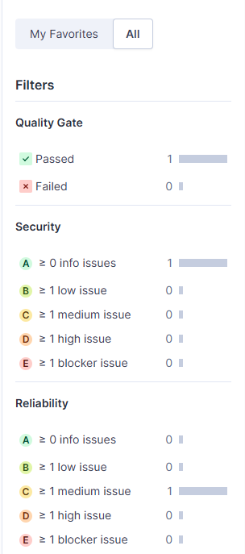

# 🧠 Pizarra Back – Real-time Whiteboard Backend

Este es el backend de una aplicación de **pizarra colaborativa en tiempo real**, desarrollada con **Spring Boot**, **WebSocket**, **Redis**, **MongoDB** y **JWT** para autenticación. Los usuarios pueden conectarse simultáneamente y dibujar sobre un lienzo compartido de manera sincrónica.

---

## 🚀 Tecnologías utilizadas

| Tecnología        | Uso principal                                 |
|------------------|-----------------------------------------------|
| Spring Boot      | Framework principal                           |
| WebSocket        | Comunicación en tiempo real                   |
| Redis            | Almacenamiento temporal (tickets, sesiones)   |
| MongoDB          | Persistencia de usuarios u otra lógica        |
| JWT              | Autenticación con tokens                      |
| JaCoCo           | Reportes de cobertura                         |
| JUnit / Mockito  | Pruebas unitarias                             |

---

## 🔐 Autenticación con JWT

- El sistema genera un `accessToken` y `refreshToken` para los usuarios autenticados.
- Los tokens se incluyen como parámetros en los WebSocket y se validan antes de permitir conexión.

---

## 🔄 WebSockets

- **`/bbService`**: Canal WebSocket donde se intercambian mensajes de dibujo.
- **`DrawingHandler`**: Envía y recibe los trazos entre usuarios activos.
- Sólo usuarios con **ticket válido** pueden establecer conexión.

---

## 🧪 Cobertura de código con JaCoCo

- JaCoCo está configurado mediante el plugin `jacoco-maven-plugin`.
- Se excluyen del reporte las clases que no requieren prueba como:
    - `PizarraBackApplication`
    - `CustomConfigurator`


## Resultados de sonarqube

# Análisis de Calidad de Código con SonarQube

Este proyecto ha sido analizado con SonarQube para asegurar la calidad, seguridad y mantenibilidad del código.

---

## Resultado del Análisis

| Métrica       | Estado          | Descripción                                  |
|---------------|-----------------|----------------------------------------------|
| **Quality Gate** | ✅ Passed      | El proyecto pasó las reglas de calidad.      |
| **Security**    | 🟢 A - 0 issues | Sin problemas de seguridad detectados.       |
| **Reliability** | 🟠 C - 1 issue  | Hay 1 problema de confiabilidad de nivel medio. |
| **Maintainability** | ⚠️ 77 issues | Se identificaron 77 problemas de mantenimiento. |
| **Coverage**    | 89.1%           | Cobertura de tests bastante buena.            |
| **Duplications**| 0.0%            | No se detectó código duplicado.               |

---


## Cómo ejecutar el análisis SonarQube

```bash
mvn clean verify sonar:sonar \
  -Dsonar.projectKey=miProyectoSpring \
  -Dsonar.host.url=http://localhost:9000 \
  -Dsonar.login=tu_token_de_sonar
```


## mas a detalle 




## cobertura con jacoco

